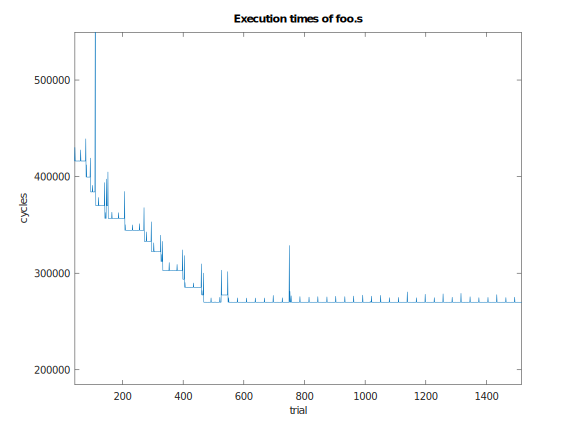

# x86-parallelism
Indagine sul parallelismo all'interno di un core x86

## Obiettivi dell'indagine
Comprendere come un singolo core di una cpu moderna x86 implementa il parallelismo.

## Cos'è il parallelismo
Una definizione operativa: il processore in un ciclo di clock esegue più istruzioni contemporaneamente.

## Principio dell'indagine
Misuro il numero di cicli impiegati per eseguire una sequenza di $n$ istruzioni semplici (per il momento limitate a operazione aritmetiche tra registri). Se il core implementa il parallelismo in qualche forma il numero di cicli impiegati dovrebbe essere $m < n$

### Misura dei cicli vs. misura del tempo
Alcune cpu implementano il [frequency scaling](https://en.wikipedia.org/wiki/Frequency_scaling), quindi la misura del tempo di esecuzione sarebbe falsata dalla frequenza di clock decisa dal sistema in quel momento. Il numero di cicli impiegati invece è indipendente dalla frequenza di clock

### Perché x86?
I processori x86 dispongono di un contatore, il time stamp counter (TSC), che viene incrementato per ogni ciclo di clock. L'istruzione rdtsc permette di leggere il valore del contatore, per maggiori informazioni si consulti [questo](https://www.felixcloutier.com/x86/rdtsc) link

La procedura di test di una sequenza di istruzioni diventa:

1. leggi il TSC
2. esegui le istruzioni
3. leggi il TSC

Il numero di cicli impiegati è la differenza delle due misure

## Cosa rende complessa l'analisi
Il programma di test viene eseguito sulla cpu sotto controllo del sistema operativo, che decide quante risorse assegnare al programma. Le misure sono soggette a variazioni imprevedibili, come mostrato nel seguente grafico:

Le spike sono dovute agli interventi del sistema operativo, ma una adeguata analisi dei dati è in grado di filtrare queste misure "rumorose".

## Quali forme di parallelismo implementa la cpu
* **Pipelining**: l'esecuzione di una istruzione è suddivisa in fasi, in ogni ciclo di clock diverse fasi di diverse istruzioni sono eseguite parallelamente
* **Out of order execution**: la cpu legge una sequenza di istruzioni (quante, lo determineremo) e ne stabilisce la dipendenza reciproca, infine esegue parallelamente le istruzioni indipendenti
* **Multicore**: solo se richiesto esplicitamente dall'utente attraverso il sistema operativo, più processori eseguono parallelamente flussi diversi di istruzioni, al costo di coordinarsi attraverso la memoria condivisa.

Sono abbastanza sicuro che un codice C che non faccia richiesta al kernel di uno o più thread sia eseguito su un solo core. Per maggiori informazioni sul modello di calcolo multicore si consulti questa discussione su [Stack Overflow](https://stackoverflow.com/questions/980999/what-does-multicore-assembly-language-look-like)

## Come spiego il miglioramento delle prestazioni del test dopo k prove
(Migliore ipotesi fino ad ora) Il kernel riconosce che il test è computazionalmente intensivo e predispone un core per lavorare solo sul thread del programma.

## Elephant in the room: il parallelismo interferisce con la misura?
Nel caso di out of order execution, è possibile che la cpu esegua l'istruzione rdtsc prima ancora di aver finito le istruzioni del test. Questo sarebbe rilevante nel caso il test sia composto da decine di istruzioni, evito il problema producendo test da 500000 istruzioni (e assumo che l'orizzonte visivo di un multiple fetch non sia nell'ordine di decine di migliaia di istruzioni)
